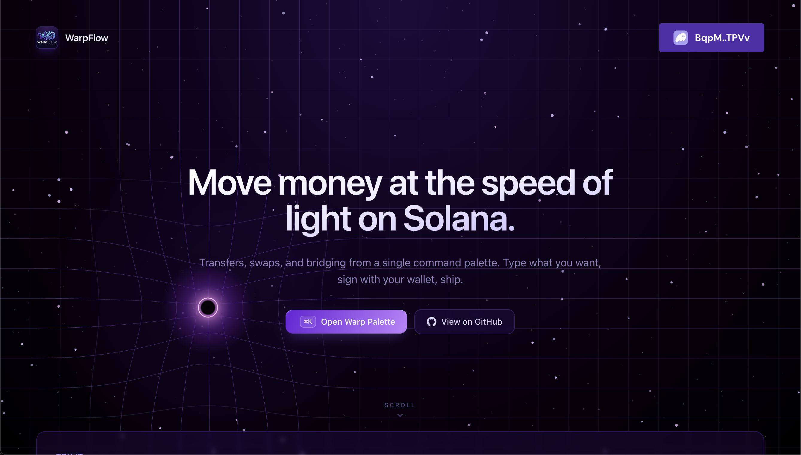
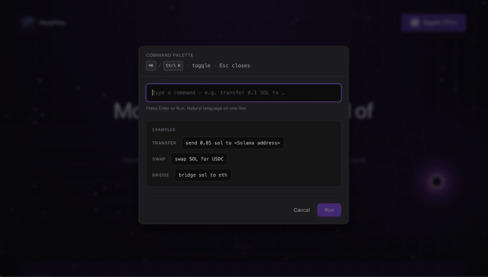
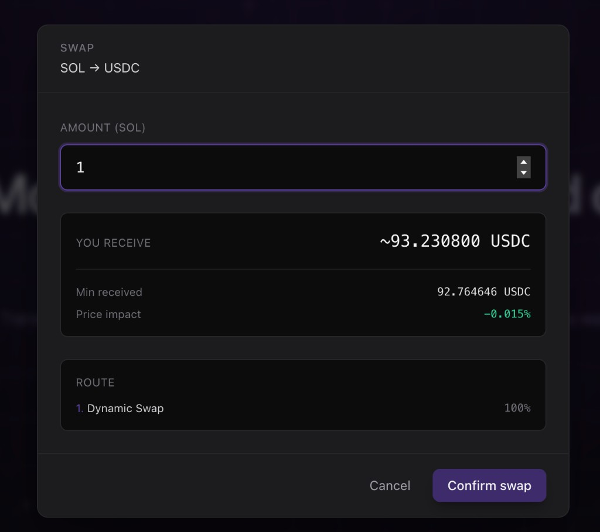

# WarpFlow

A web portal for moving value on Solana: send SOL, swap tokens, and bridge SOL to Ethereum through a single command-driven experience.

## Main UI

The landing hero: open the Warp palette (**⌘K** / **Ctrl+K**), connect your wallet, and run transfers, swaps, or bridge commands from one place.



## Command palette

Type one-line commands for **transfer**, **swap** (Jupiter), or **bridge** (SOL → ETH). Press **Enter** or **Run** after connecting your wallet.



## Swap modal

Opening a **swap** command brings up a modal with the live Jupiter quote: amount in, **estimated receive**, **min received**, **price impact**, and a **Route** section that shows the **detailed routing path** — each leg of the aggregate route (e.g. venue labels and how the flow is split). Transfer and cross-chain modals use the same general layout so the experience stays consistent.



## What you can do

Three flows are built in:

1. **Transfer SOL** — Send native SOL to any valid Solana address with a natural-language command.
2. **Swap tokens** — Trade supported Solana tokens via **Jupiter**. After the quote loads, you see the full breakdown: **min received**, **price impact**, and the **step-by-step route** Jupiter selected before you confirm and sign.
3. **Cross-chain (SOL → ETH)** — Bridge SOL to Ethereum using **NEAR Intents** (1Click API). You enter an amount and an Ethereum recipient (`0x…`), receive a quote and deposit instructions, then sign a Solana transfer to the deposit address; settlement is tracked through the bridge.

Open the **command palette** with **⌘K** (Mac) or **Ctrl+K** (Windows/Linux), connect a wallet, and run typed commands — or use the same flows from the UI where provided.

---

## Environment variables

Create a `.env` or `.env.local` in the project root (never commit real secrets).

| Variable | Purpose |
| -------- | ------- |
| **`VITE_JUPITER_API_KEY`** | **Required for swaps.** Jupiter’s Swap API expects an API key (`x-api-key`). Get one from the [Jupiter developer portal](https://developers.jup.ag/portal). Without it, swap quotes will fail. |
| **`VITE_ONECLICK_JWT`** | **Optional for cross-chain.** NEAR Intents’ 1Click API works without auth, but adding a JWT (see [NEAR Intents authentication](https://docs.near-intents.org/integration/distribution-channels/1click-api/authentication)) can remove or reduce the platform fee on 1Click usage. |

Restart the dev server after changing env vars.

---

## Integrations at a glance

- **Swaps —** [Jupiter](https://jup.ag) Meta-Aggregator (`/swap/v2`): aggregate liquidity, route construction, assembled transactions, and **transparent route plans** in the UI (how your trade is split across pools and venues).
- **Cross-chain bridge —** [NEAR Intents](https://docs.near-intents.org) 1Click API: quotes, deposit addresses, and status for SOL → ETH (and related policy set by 1Click). This is not an on-chain Jupiter swap; it’s a separate bridge path.

---

## Example commands

- **Transfer:** `transfer 0.1 SOL to <solana-address>` (or `send …`)
- **Swap:** `swap SOL for USDC` or `swap 0.5 SOL for USDC`
- **Bridge:** `bridge sol to eth` or `bridge 0.2 sol to eth` (optional `0x…` recipient on the same line)

Supported swap symbols are defined in the app’s token list (e.g. SOL, USDC, USDT, JUP, and others). For **SOL → ETH**, use the bridge command — Jupiter swaps stay on Solana.

---

## Run locally

```bash
npm install
npm run dev
```

Use a Solana wallet (e.g. Phantom, Solflare). The app may default to **devnet** for development; **NEAR Intents deposits expect mainnet SOL** at the quoted deposit address — switch to Solana **mainnet** for real cross-chain tests.

---

## License

See `LICENSE` or the `license` field in `package.json` if present.
